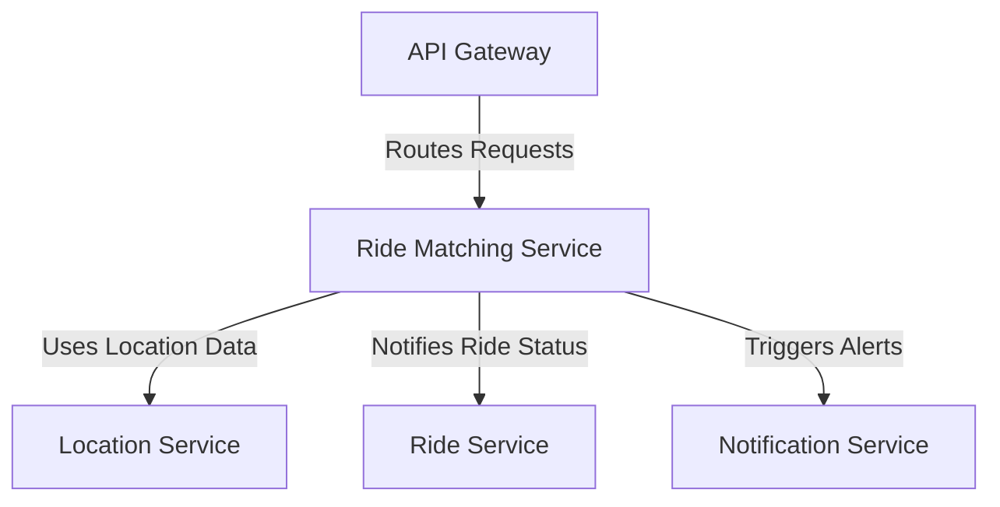

# Ride Matching Service

The Ride Matching Service is a microservice in the ride-booking system that uses algorithms to match riders with nearby available drivers based on location, availability, and ratings.

## Key Features
- **Proximity Matching**: Matches drivers to riders using geospatial data.
- **Algorithm Optimization**: Incorporates machine learning for efficient pairing over time.
- **Priority Queue**: Selects drivers based on distance, traffic, and ratings.

## Architecture Diagram

## Interaction with Other Services
The Ride Matching Service coordinates with other components to ensure optimal driver-rider pairing:
- **API Gateway**: Receives ride requests routed to initiate matching processes.
- **Location Service**: Fetches real-time location data to identify nearby drivers for matching.
- **Ride Service**: Updates ride status once a match is confirmed, integrating the pairing into the ride lifecycle.
- **Notification Service**: Sends notifications to drivers and passengers about successful matches or ride offers.

