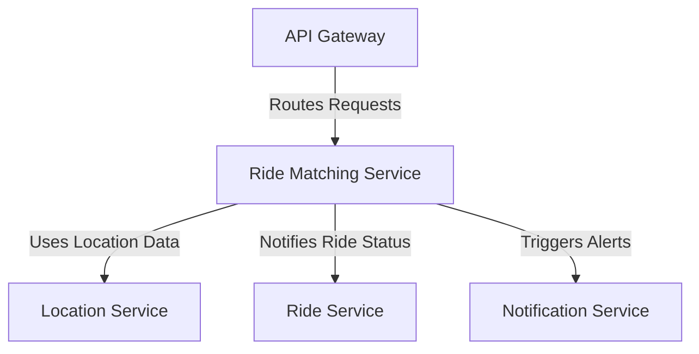

# Ride Matching Service

The Ride Matching Service uses algorithms to match riders with nearby available drivers based on location, availability, and ratings.

## Key Features
- Proximity Matching
- Algorithm Optimization
- Priority Queue

## Recommended Tech Stack
- **Runtime**: Go for high-performance matching algorithms [1][5].
- **Framework**: Custom Go libraries or Node.js for alert management [1].
- **Database**: Redis for caching driver availability; Riak for distributed storage [1].
- **Machine Learning**: Python with Flask for optimizing matches over time [1].

## System Design Structure
- **Matching Engine**: Implements priority queue for driver selection.
- **Location Fetcher**: Queries Location Service for proximity data.
- **ML Module**: Uses historical data for improved matching.
- **Cache Layer**: Redis stores active driver data for quick access.
- **Event Handler**: Triggers notifications on successful matches.

## Architecture Diagram

## Interaction with Other Services
The Ride Matching Service ensures optimal pairing:
- **API Gateway**: Receives ride requests for matching.
- **Location Service**: Fetches real-time driver locations.
- **Ride Service**: Updates ride status post-match.
- **Notification Service**: Alerts drivers and passengers of matches.

